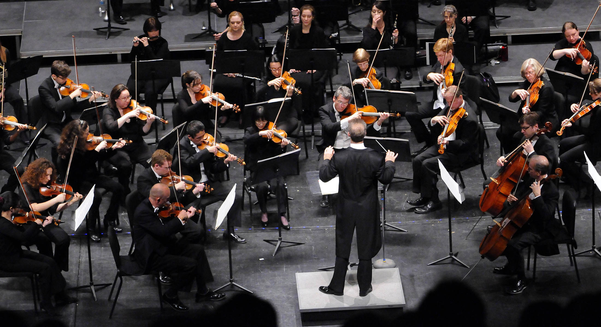
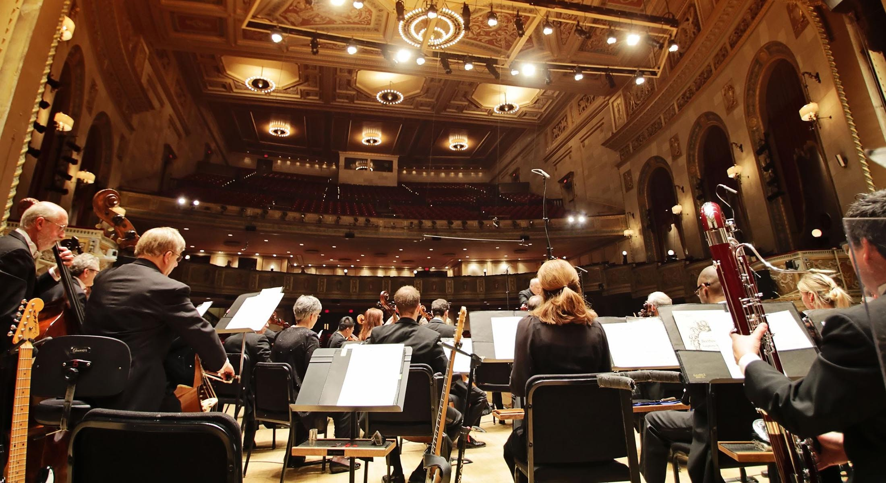

<!DOCTYPE html>
<html lang="pt">
<title>Real Câmara</title>
<meta charset="UTF-8">
<meta name="viewport" content="width=device-width, initial-scale=1">
<link rel="stylesheet" href="https://www.w3schools.com/w3css/4/w3.css">
<link rel="stylesheet" href="https://cdnjs.cloudflare.com/ajax/libs/font-awesome/4.7.0/css/font-awesome.min.css">
<link rel="stylesheet" href="https://fonts.googleapis.com/css2?family=IM+Fell+Double+Pica+SC">
<link rel="stylesheet" href="https://fonts.googleapis.com/css2?family=Cormorant:wght@400">
<link rel="stylesheet" href="https://fonts.googleapis.com/css2?family=Crimson+Pro:wght@300">
<link rel="stylesheet" href="https://fonts.googleapis.com/css2?family=Cormorant+Upright:wght@400">

<body>

<!-- Navbar -->

  

    <a href="#" class="w3-bar-item w3-button w3-padding-large">HOME</a>
    <a href="#about" class="w3-bar-item w3-button w3-padding-large w3-hide-small">ORQUESTRA</a>
    <a href="#calendar" class="w3-bar-item w3-button w3-padding-large w3-hide-small">AGENDA</a>
    <a href="#contact" class="w3-bar-item w3-button w3-padding-large w3-hide-small">CONTACTOS</a>
  

<!-- Navbar on small screens (remove the onclick attribute if you want the navbar to always show on top of the content when clicking on the links) -->

  <a href="#about" class="w3-bar-item w3-button w3-padding-large" onclick="myFunction()">ORQUESTRA</a>
  <a href="#calendar" class="w3-bar-item w3-button w3-padding-large" onclick="myFunction()">AGENDA</a>
  <a href="#contact" class="w3-bar-item w3-button w3-padding-large" onclick="myFunction()">CONTACTOS</a>

<!-- Page content -->

  <!-- Automatic Slideshow Images -->
  

    

      
    

    

      
      <!--<h1 class="w3-xxlarge w3-text-white"><b></b> Real Câmara</h1>-->
    

    <!--

      <h3>Los Angeles</h3>
      
<b>We had the best time playing at Venice Beach!</b>

    
-->
  

  <!-- The Band Section -->
  

    <h2 class="w3-wide">A ORQUESTRA</h2>
    
<i></i>

    
O projecto da Real Câmara consiste na criação de uma orquestra portuguesa dedicada à interpretação historicamente informada, com especial enfoque no repertório setecentista português, e nas suas ligações a Itália. Pretende explorar particularmente o espólio da biblioteca do Palácio Nacional da Ajuda, onde o grupo terá sede, que, para além de ser incontornável para o estudo da música portuguesa, preserva uma das maiores e mais importantes colecções mundiais de ópera do século XVIII.

    
Formada maioritariamente por intérpretes portugueses com formação específica na área da música antiga, e que desenvolvem uma actividade profissional regular em agrupamentos de renome europeu, a Real Câmara pretende centralizar e potenciar um trabalho que já vem sendo realizado por vários dos seus membros, desde há vários anos e em contextos paralelos, com o maestro Enrico Onofri, sempre com grande empatia e partilha artísticas.

    
A recuperação de património musical, identitário da abordagem musical de cariz histórico, é parte integrante dos percursos de vários dos membros da orquestra – dois deles doutorandos em musicologia histórica – sendo este vínculo com a historiografia musical reforçado pela colaboração com outros musicólogos especializados no século XVIII português, entre os quais se destaca a consultora científica da Real Câmara, Dra. Cristina Fernandes. Nesse sentido, será dada particular atenção ao alargado espólio da Biblioteca da Ajuda, assim como ao de outros arquivos nacionais como a Biblioteca Nacional de Portugal, ou o Arquivo da Fábrica da Sé Patriarcal de Lisboa, onde é mantida uma grande quantidade de obras que não conheceram ainda execuções modernas. A colecção de música vocal da Biblioteca da Ajuda ocupará um lugar de destaque, assim como várias obras sacras de tradição especificamente portuguesa que têm sido negligenciadas até à data.

  

  <!-- Calendar Section -->
  

    

      <h2 class="w3-wide w3-center">AGENDA</h2>
      
<i></i>
 

      <ul class="w3-ul w3-border w3-white w3-text-grey">
        <li class="w3-padding">
          <h2>Março 2021</h2>
          <h2>Dal Tevere al Tago: Música ao gosto italiano para a Orquestra da Real Câmara</h2>
          <h5>REAL CÂMARA Enrico Onofri, violino solo e direcção Ana Quintans, soprano</h5>
          <h4>  Programa</h4>
          <h5><b>Pedro Jorge Avondano (1692-ca.1755?)</b> Divertimento II 
          <b>Giovanni Bononcini (1670-1747)</b> Ária “Mio sposo t’arresta” 
          <b>Nicola Porpora (1686-1768)</b> Concerto con Violoncello obbligato e Violini 
          <b>Francisco António de Almeida (1703-1754)</b> Ária “Quell'amor che il petto acende” 
          <b>Gaetano Maria Schiassi (1698-1754)</b> Concerto I à violino principale 
          <b>Rinaldo di Capua (ca.1705-ca.1780)</b> Sinfonia 
          <b>Rinaldo di Capua (ca.1705-ca.1780)</b> Ária “Só ben ch’è penoso lasciar chi si adora” 
          <b>José Palomino (1755-1810)</b> Concerto o sia Quinteto per Cembalo o Piano-Forte 
          <b>David Perez (1711-1778)</b> Ária “Io so qual pena sia quella d’un cor geloso”</h5>
        </li>
      </ul>

    

  

  <!-- The Contact Section -->
  

    <h2 class="w3-wide w3-center">CONTACTOS</h2>
    
<i></i>

    

      

        <i class="fa fa-map-marker" style="width:30px"></i> Lisboa, Portugal 
        <i class="fa fa-phone" style="width:30px"></i> Telefone: +351 151 515 151 
        <i class="fa fa-envelope" style="width:30px"> </i> E-mail: mail@mail.com 
      

      

        <form action="/action_page.php" target="_blank">
          

            

              <input class="w3-input w3-border" type="text" placeholder="Nome" required name="Name">
            

            

              <input class="w3-input w3-border" type="text" placeholder="E-mail" required name="Email">
            

          

          <input class="w3-input w3-border" type="text" placeholder="Mensagem" required name="Message">
          <button class="w3-button w3-black w3-section w3-right" type="submit">ENVIAR</button>
        </form>
      

    

  

<!-- End Page Content -->

<!-- Image of location/map -->

<!-- Footer -->
<footer class="w3-container w3-padding-64 w3-center w3-opacity w3-light-grey w3-xlarge">
  <i class="fa fa-facebook-official w3-hover-opacity"></i>
  <i class="fa fa-instagram w3-hover-opacity"></i>
  <i class="fa fa-twitter w3-hover-opacity"></i>
  <i class="fa fa-linkedin w3-hover-opacity"></i>
  
Powered by <a href="https://www.w3schools.com/w3css/default.asp" target="_blank">w3.css</a>

</footer>

</body>
</html>
